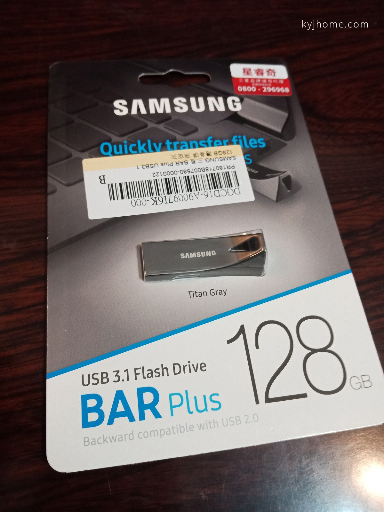
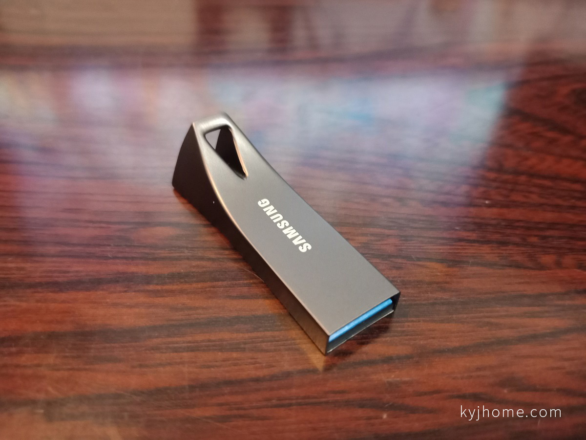
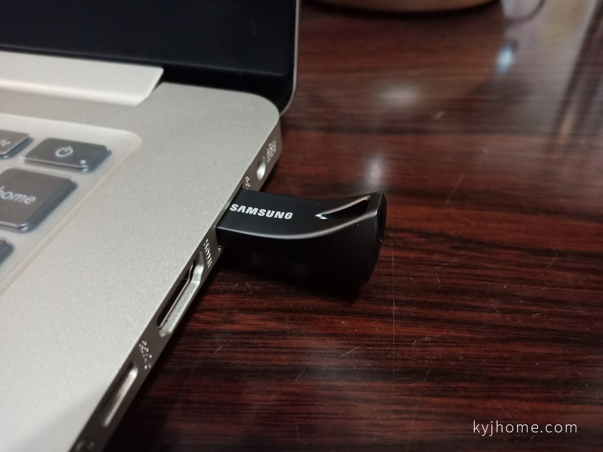
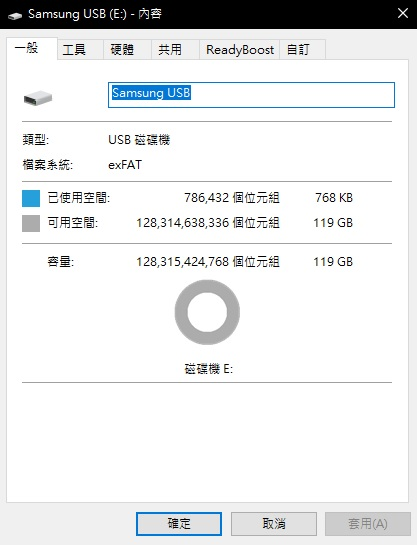
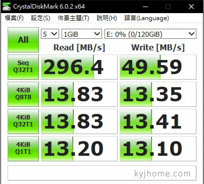

看到 pchome24 正在特價，只要 $799 ！

手癢買了一個 ><

 

外包裝

 

外觀

非常有質感！！

 

可用空間 119 GB

 

使用 CrystalDiskMark 6.0.2 測試

讀取速度 296.4 MB/s

寫入速度 49.59 MB/s

分享結束~

 

後記：

後來發現隨身碟被筆電刮傷…

可能筆電 USB 插座太緊，有點心痛 QQ
