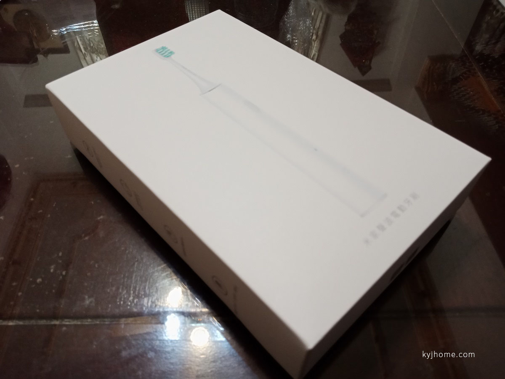
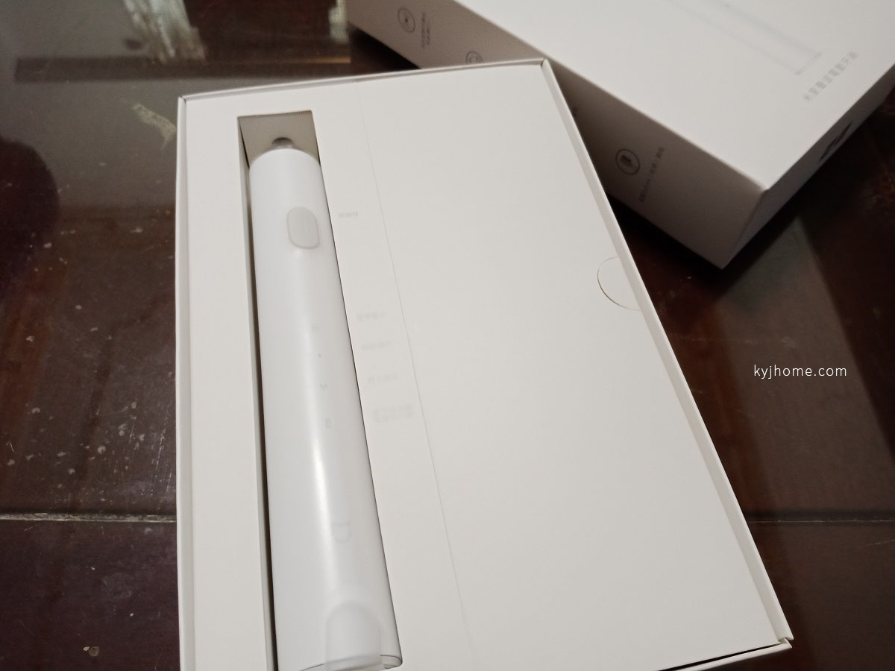
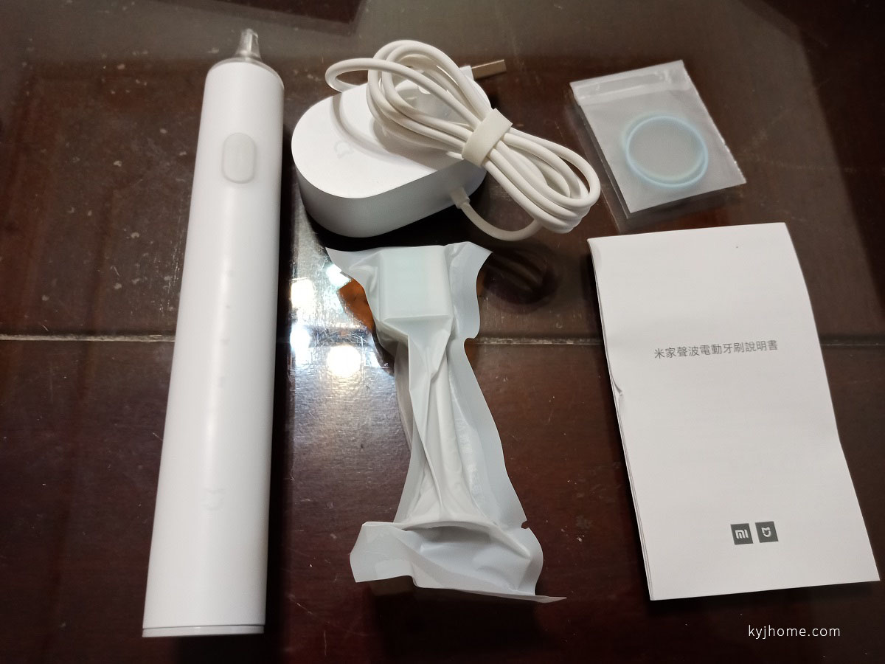
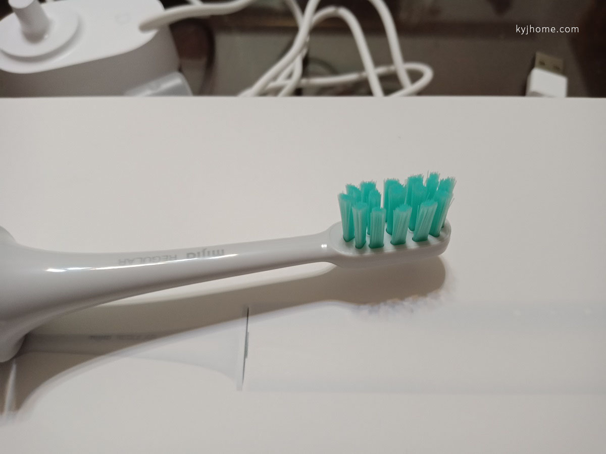
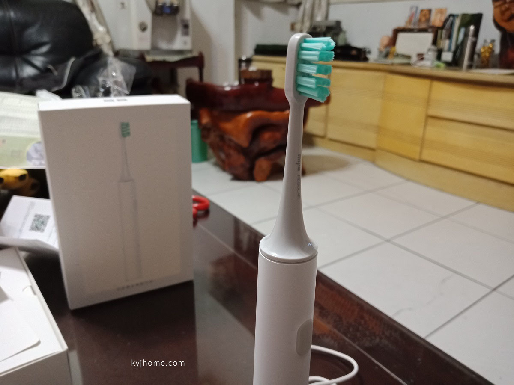
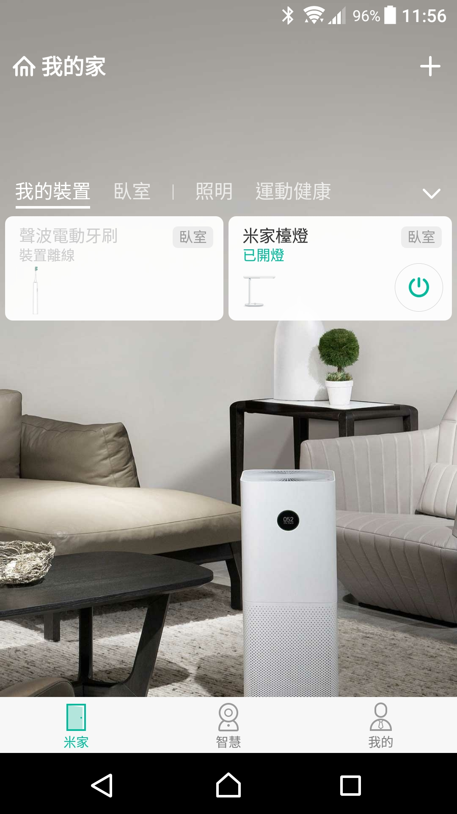
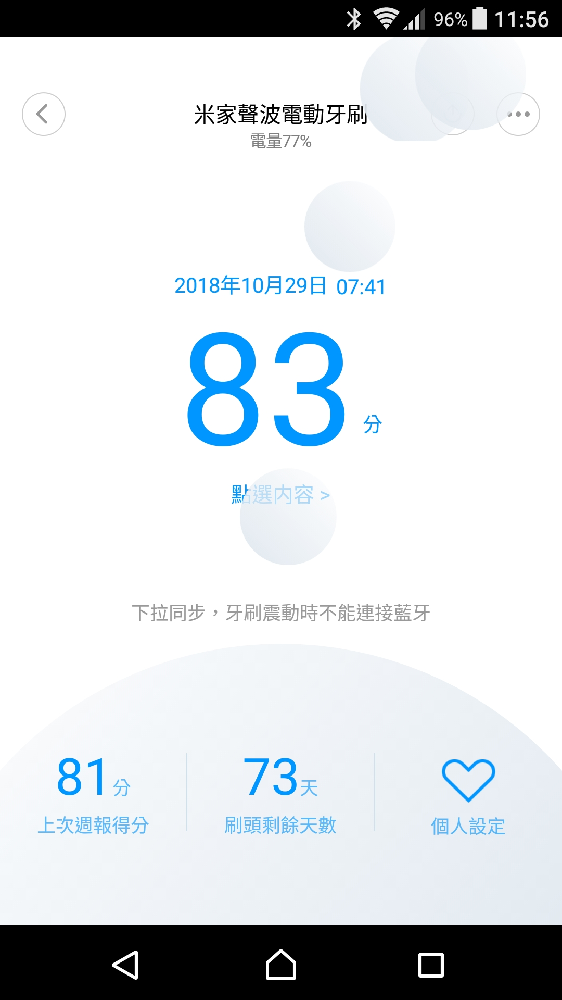
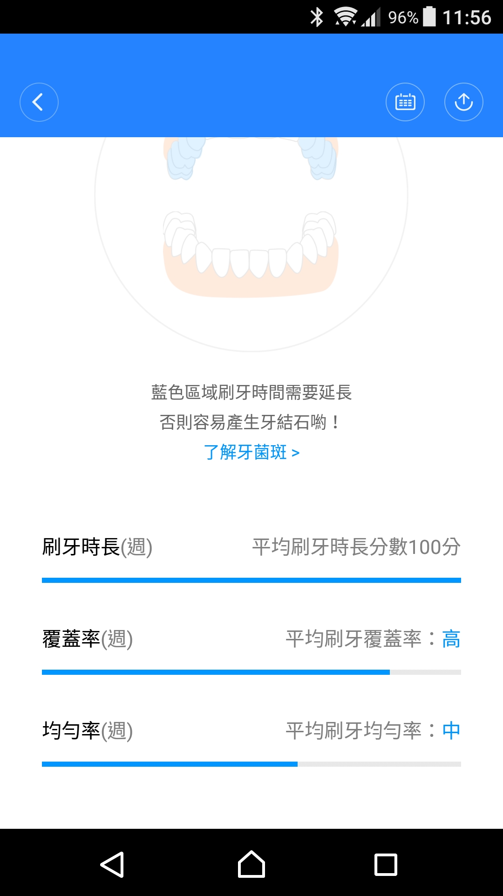
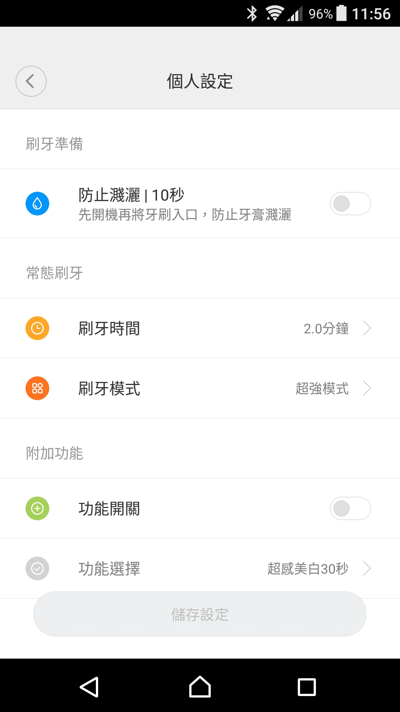

人生第一隻的電動牙刷就獻給小米了 xD

 

來看看外包裝

 

打開盒子，簡約設計

 

拿出所有配件

 

內附的刷頭

 

APP 部分

 

我覺得同步還滿麻煩的…

要開藍芽跟地點…

 

詳細報表

 

個人設定

 

心得：

以千元不到的價格，

我覺得算很不錯了，基本該有的都有了~

我個人使用習慣大概 4~5 天充一次電~

唯一缺點就是跟 APP 同步，覺得麻煩@@
