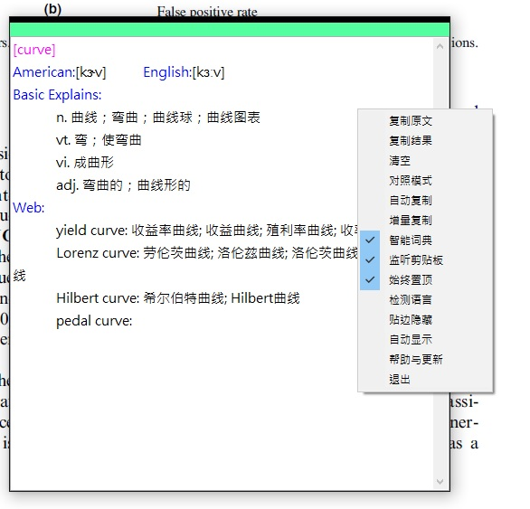

# CopyTranslator

每當要看英文文獻的時候，要打開瀏覽器的 Google 翻譯，在那邊切換來切換去的很不方便，自從發現這軟體之後，我覺得對我幫助很大，可以節省很多時間，尤其在 PDF 段落問題，這軟體基本上段落問題都會幫你處理好了，還可以針對個別單字做翻譯，非常的好用~

主要功能：

複製即翻譯

按下 Ctrl+C 即可翻譯，效果可看下面動圖

 

個別單字翻譯

 

功能面板：

可以開啟「始終置頂」功能，這功能滿實用的，不用一直切畫面~

 

軟體下載：

https://github.com/elliottzheng/CopyTranslator/releases
