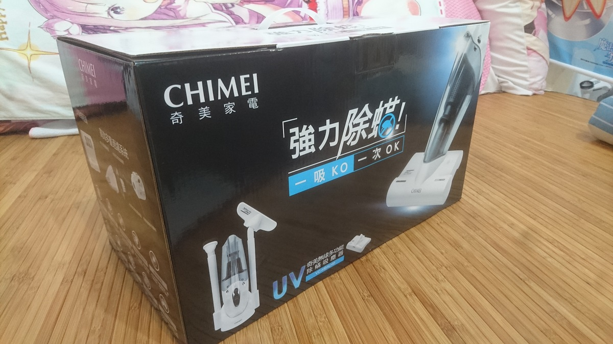
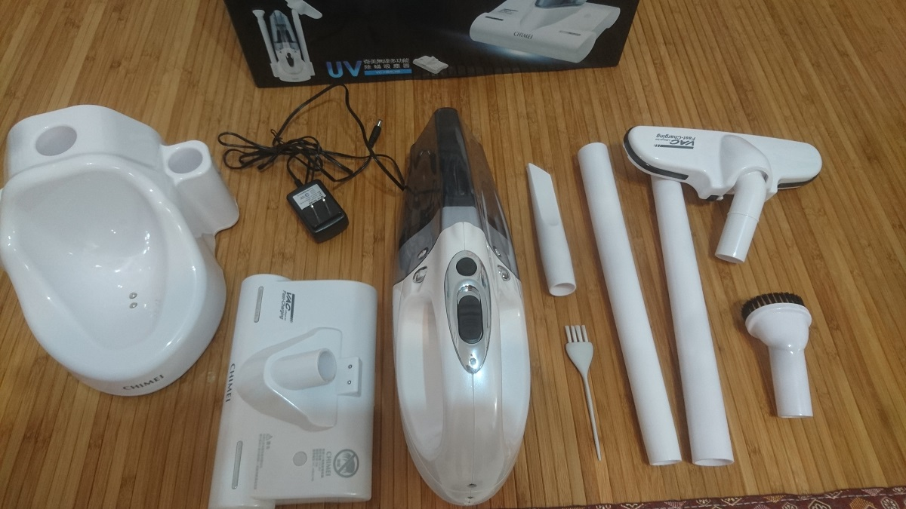
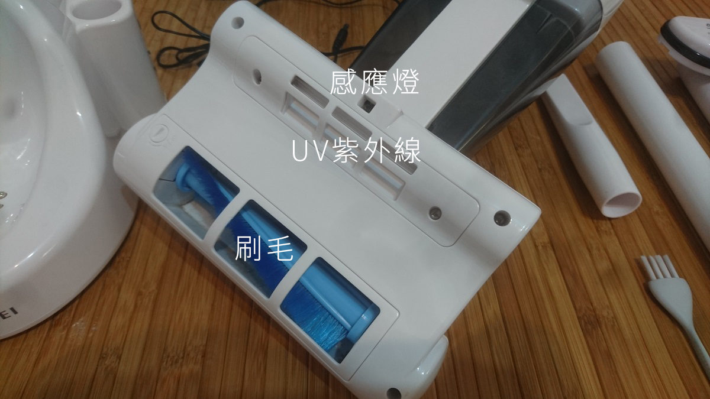
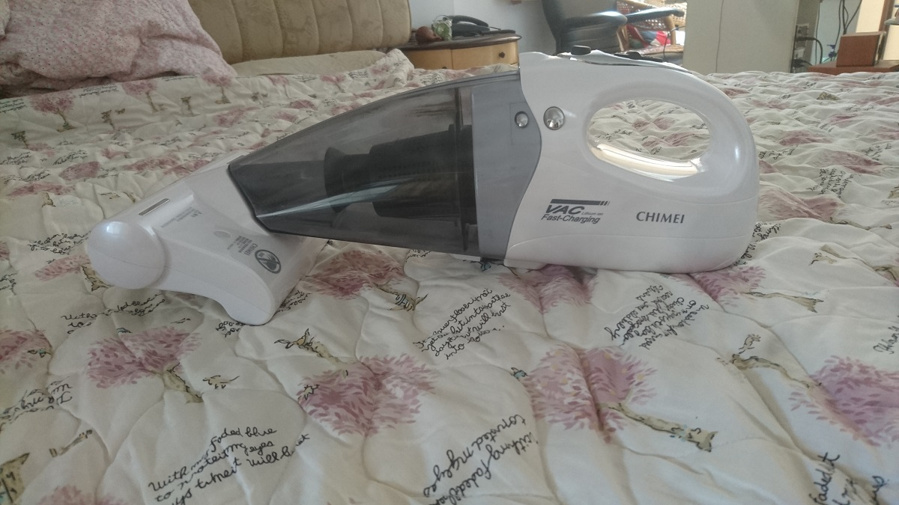
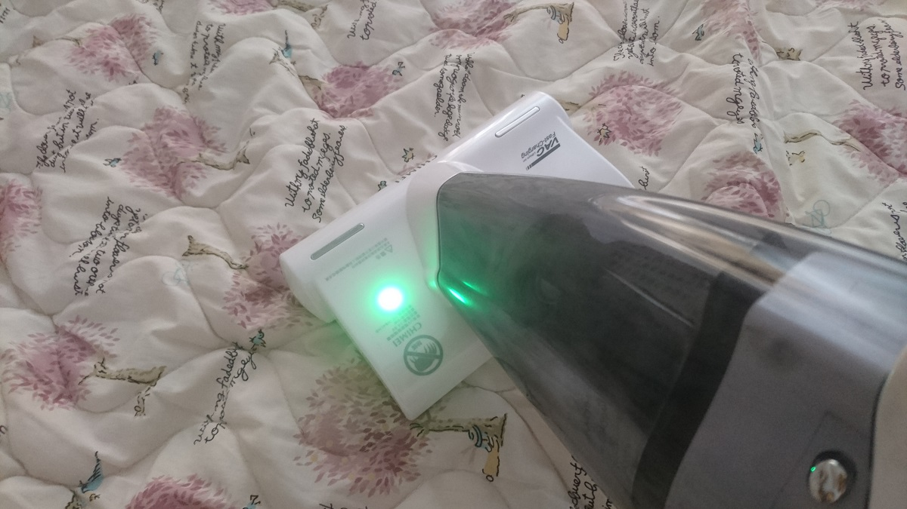
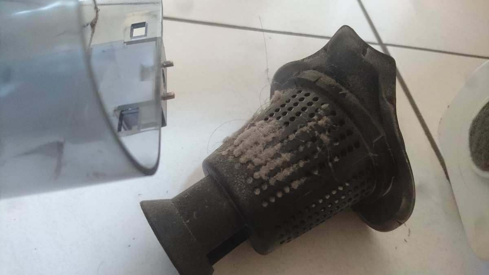
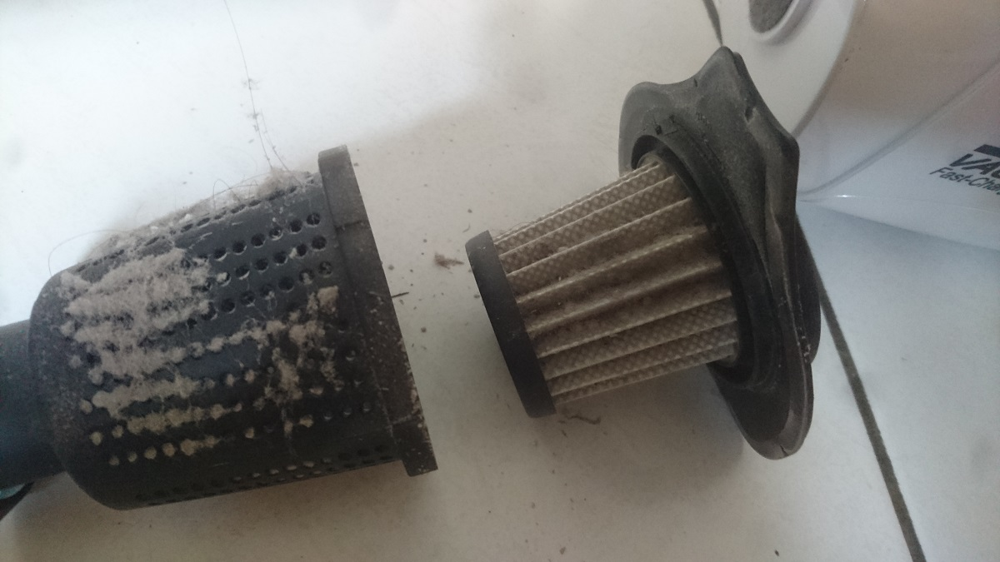
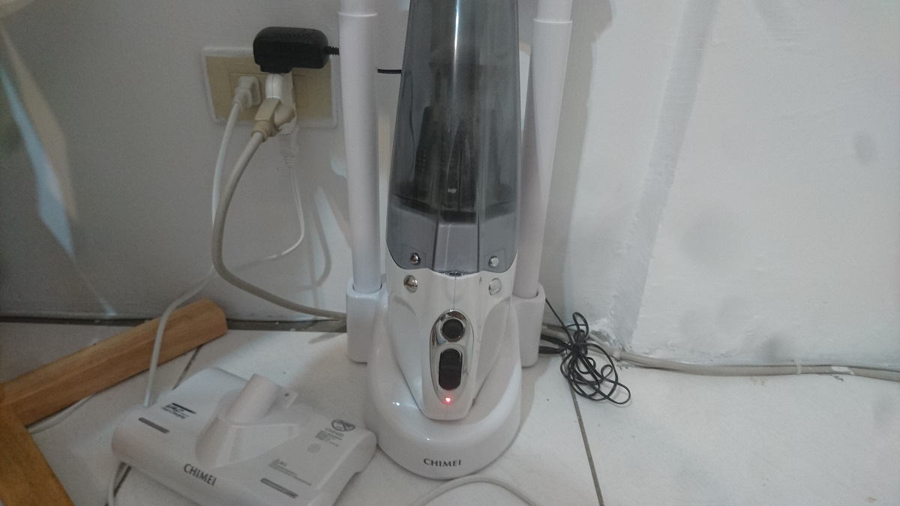

最近想買吸塵器

所以在網路上了解有哪些款式，但預算有限…

但看到這款$3,000 有找的無線吸塵器，整個心動動 ^0^

這款最大特點就是有除蹣吸頭配件，號稱每分鐘可拍打 7000 次，也有 UV 紫外線殺菌，

整隻重量僅 1.1KG，

所以決定購買了這組 VC-HB4LH0，

(雖然我已經使用好幾天了，才發文分享~)

 

下面圖是所有商品配件 ( 後來才發現我少拍了一根軟管 QQ)

 

其中最大亮點就是這個除蹣吸頭，來看看它的背後美照

 

因為我的床鋪吸過了，所以我拿我家人的棉被試試，

 

正在吸的時候，會顯示綠光，確保 UV 紫外線有亮，

如果沒亮就要拿小刷子清理一下感應燈的灰塵，

 

吸完的灰塵~

 

可以拆開來，這兩個都可以拿去水洗~

 

下面圖是所有商品配件 ( 後來才發現我少拍了一根軟管 QQ)

最後使用完就要好好的充電了，

正在充電時會顯示紅光，充飽就會顯示綠光，

說明書上寫：充滿電約 4 小時多，可持續使用時間 20~25 分鐘

充飽時記得拔掉插頭喔！

 

總心得：

造型設計好看，重量不重，吸力也夠，也能吸床單棉被，對我來說是一款 CP 值很高的吸塵器。

分享結束~~
