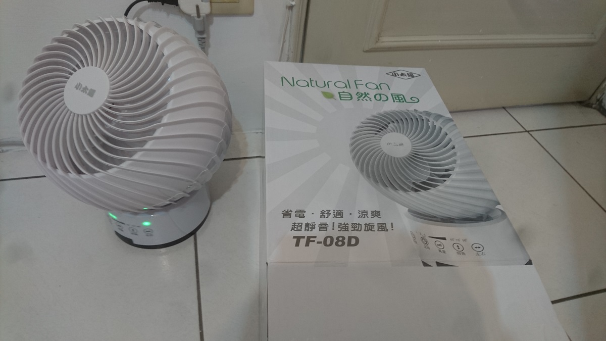
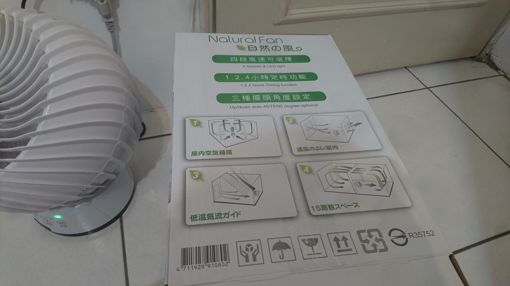
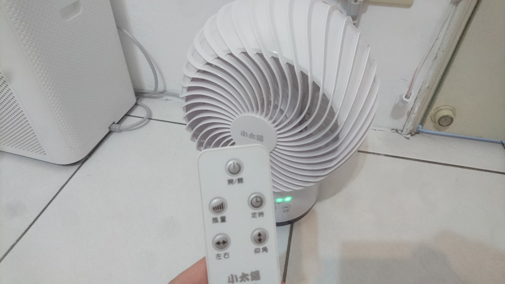
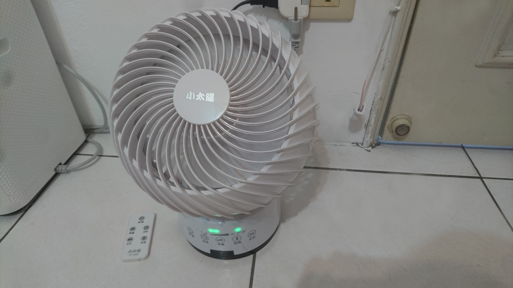
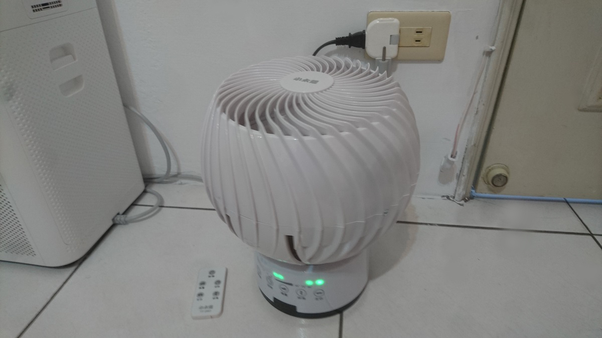

夏天到了，

想買一台循環扇來加速房間空氣對流，

在網路上看到這一台，剛好看到某購物網站正在促銷，一張小朋友有找！！

外型設計我覺得不錯，

 

還有附一個遙控器！

這樣就不用蹲下來按開關了~

 

在風量部分，有分四種大小，

第三段的噪音就有點大，到了四段我覺得就無法接受…

 

仰角可「45 度、75 度、90 度、固定」，

左右可「自動左右、固定」，

定時可「1、2、4」小時，

 

整體上算是一台不錯的循環扇，外型與功能兼具，價格也不昂貴。

分享結束~
