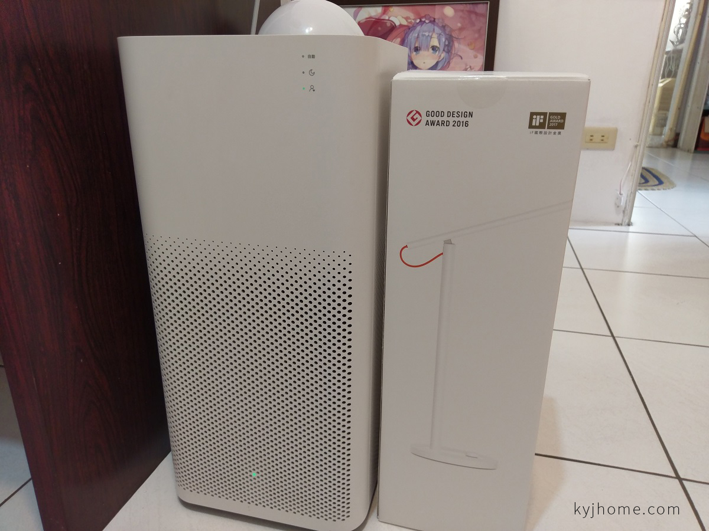
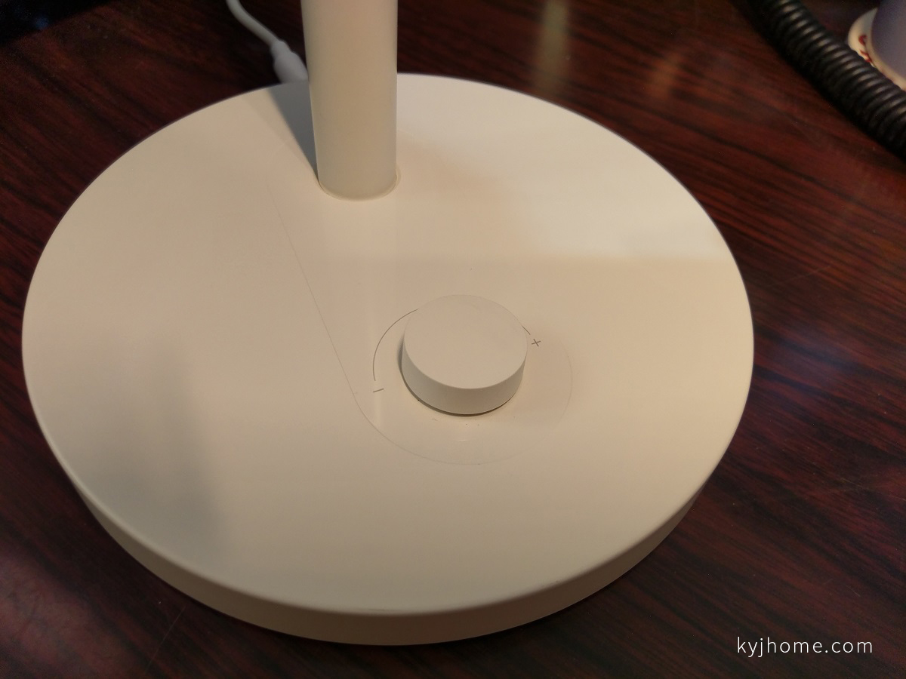
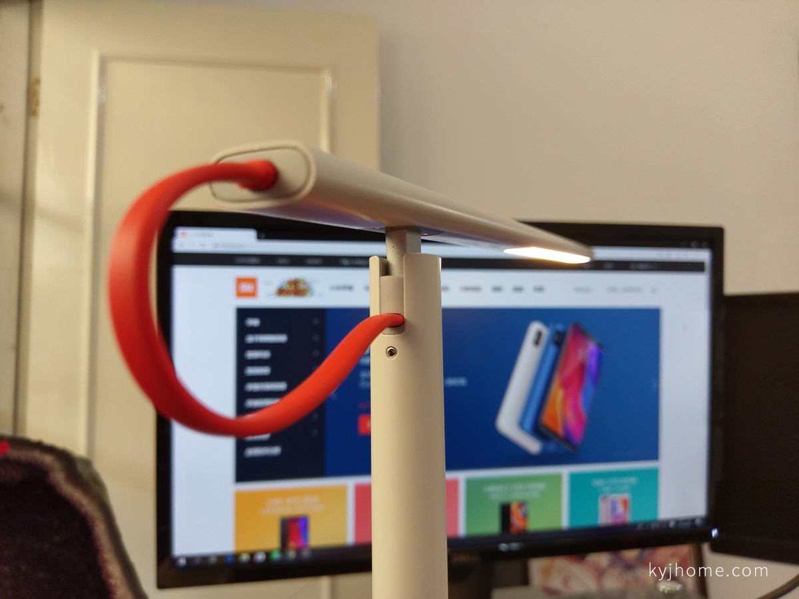
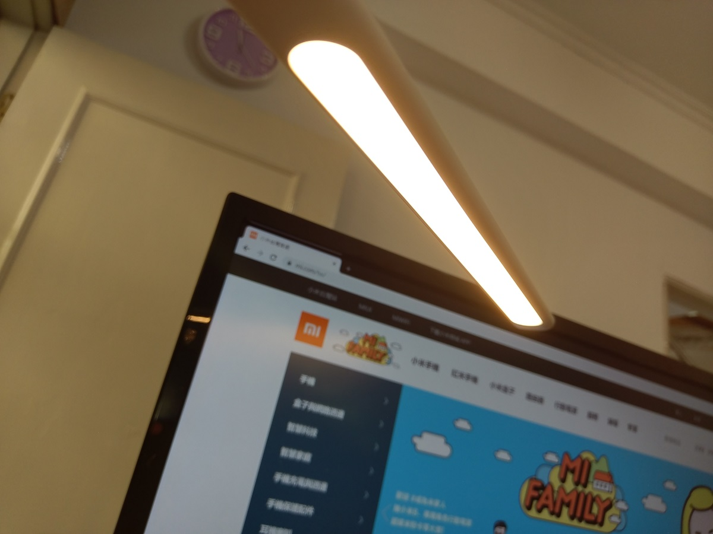
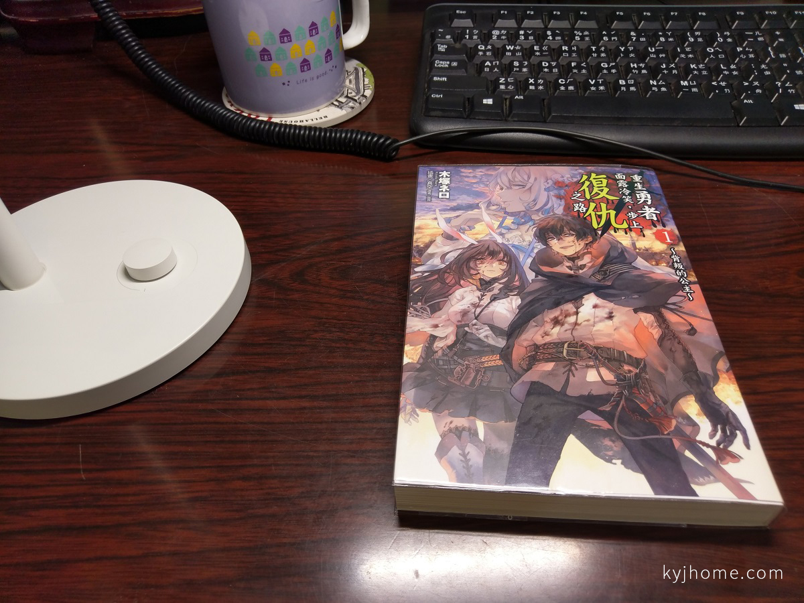
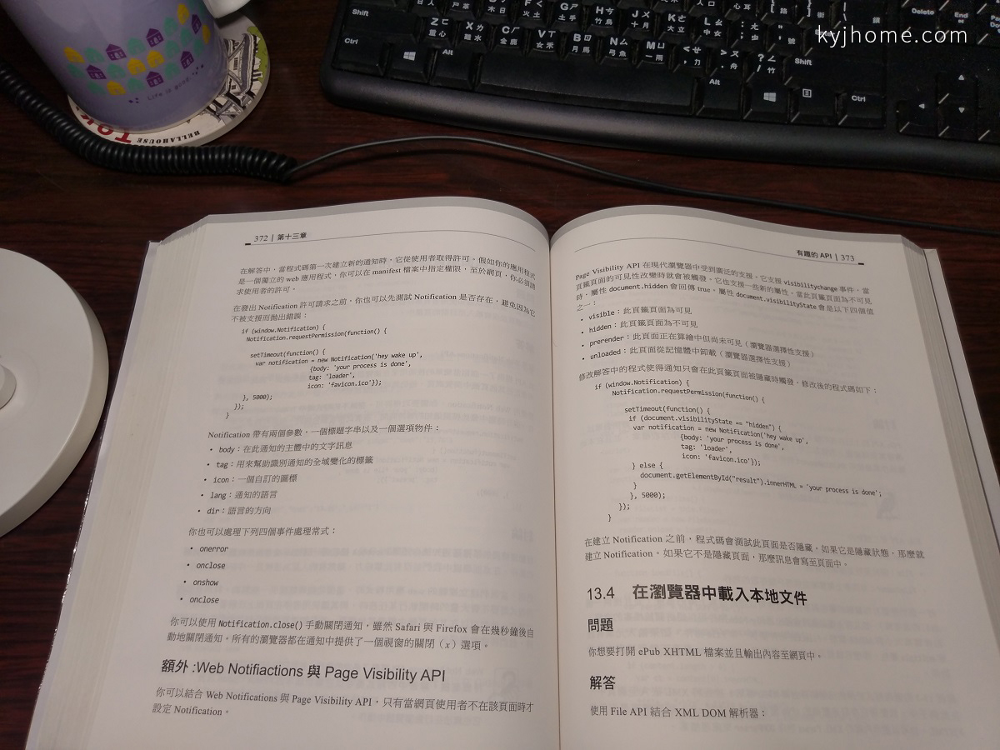
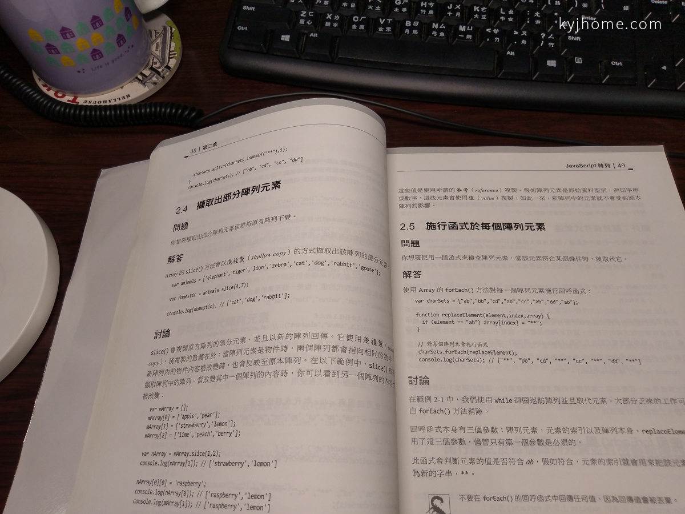
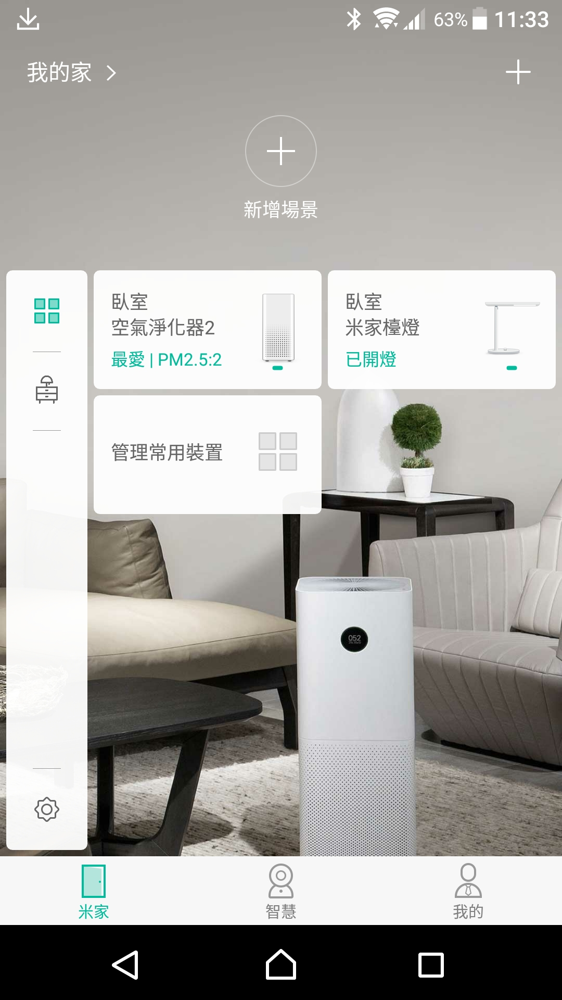
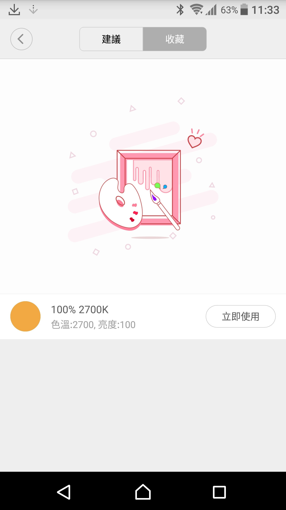

趁著 pchome24H 限時下殺活動，

以優惠的價格入手小米檯燈，

外箱紙盒高度快跟空氣清淨機 2 一樣高了，

 

檯燈只有一個按鈕，

按一下是開關，

旋轉可調燈光亮度，

按壓旋轉可調光的色溫，

 

APP 預設用電腦燈光模式 (30%/2700K)

 

拿本輕小說試試，

APP 閱讀模式 (100%/4000K)

 

換本書試試看 XD

 

介紹一下，APP 介面，

米家 APP 有做裝置整合，

可看到所有的米家相關產品裝置一覽，

 

調光模式，可自由調整燈光亮度、色溫，

 

閱讀模式 (100%/4000K)

 

用電腦模式 (30%/2700K)

 

可保存自訂燈光模式，

 

總結：

千元不到的檯燈，

外觀設計簡約，非常有質感，

可自由調整燈光亮度、色溫，再加上可用 APP 遠端操作，

是一台 CP 值非常高的檯燈，

要說缺點的話，就是亮度開到 100%，我覺得燈光還不夠亮吧@@

 

分享結束~~~~
