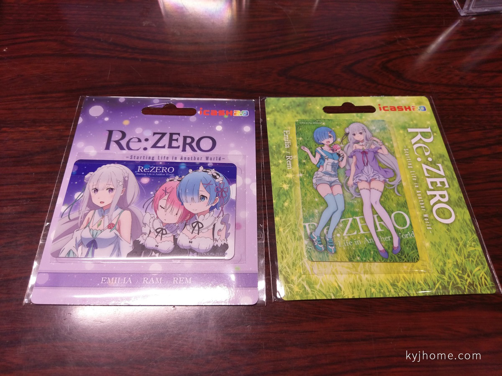
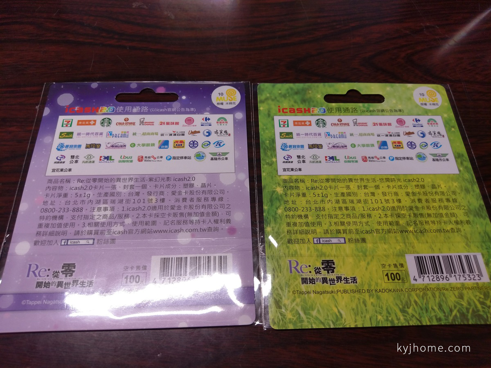
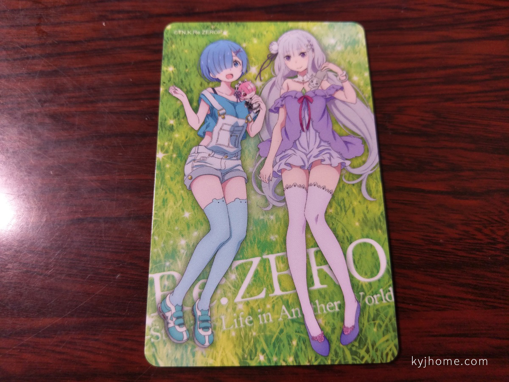
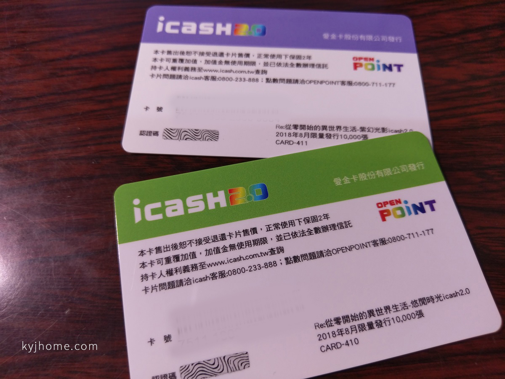
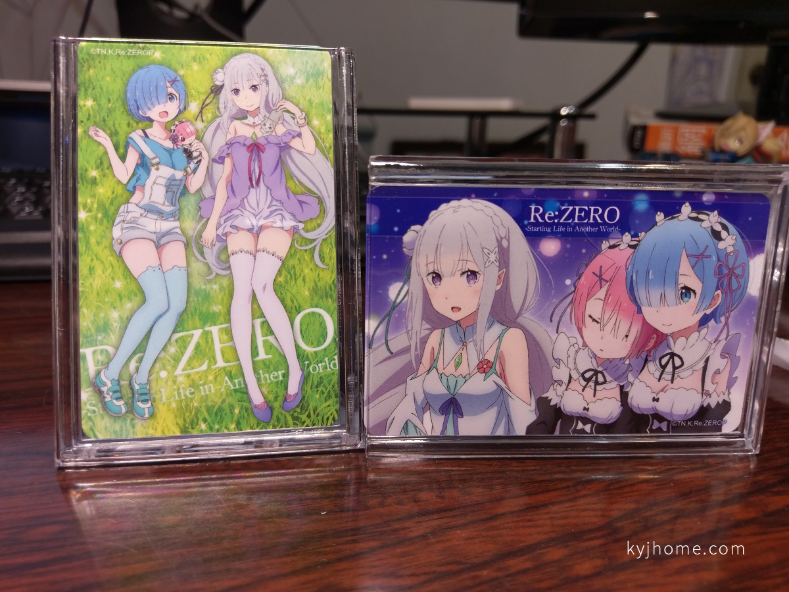

繼上次推出愛蜜莉雅/雷姆 (點我可參考上次的開箱文)，

今年 8 月又推出全新的卡面了 ！！

 

先來看看官方的文宣，

這次是各限量 10,000 張，

有別於上次只有 6,000 張而已，

 

先來看看外觀包裝照，

 

背後照，

有貼木棉花授權貼紙，

 

拆開包裝之後~~

 

單獨照：紫幻光影

拉姆終於出現啦！

 

單獨照：悠閒時光

這張圖跟木棉花推出的台灣限定等身掛軸圖是差不多的~~

 

卡背面，

有寫限量發行 10,000 張 (我遮一下卡號)，

 

最後放進壓克力架裡 ^\_\_\_^

 

總結：

我覺得這次推出的卡面沒有比上次好看，上次的還可以合體，但這次有拉姆~~

分享結束~~~~
