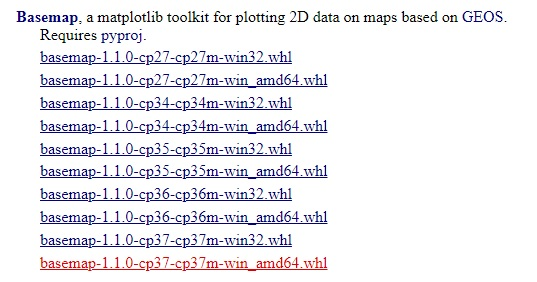
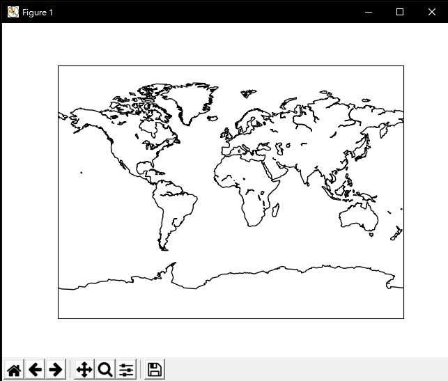

測試環境：Windows10 Python3.7

自己筆記紀錄一下…

<br/>

# 一、安裝 geos

首先要先安裝 geos，在 cmd 輸入：

```python{numberLines: true}
pip install geos
```

<br/>

# 二、下載 pyproj 和 basemap 檔案

在 https://www.lfd.uci.edu/~gohlke/pythonlibs/下載 pyproj 和 basemap

找自己對應的版本，例如我安裝的 python 是 3.7，就是 cp37、64 位元



<br/>

# 三、安裝 pyproj 和 basemap

移動到下載目錄，例如我把檔案放在 D:\python，在 cmd 指令輸入：

```python{numberLines: true}
cd /d D:\python
```

<br/>

然後要先安裝 pyproj 才能再安裝 basemap，不然會報錯，在 cmd 指令輸入：

```python{numberLines: true}
pip install pyproj-1.9.5.1-cp37-cp37m-win_amd64.whl
pip install basemap-1.1.0-cp37-cp37m-win_amd64.whl
```

安裝完成會顯示 Successfully installed

<br/>

# 四、檢查是否安裝成功

馬上來畫出一張世界地圖看看

```python{numberLines: true}
from mpl_toolkits.basemap import Basemap
import matplotlib.pyplot as plt
m = Basemap(projection='mill')
m.drawcoastlines()
plt.show()
```


