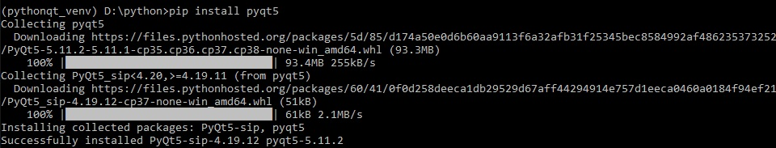
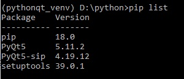
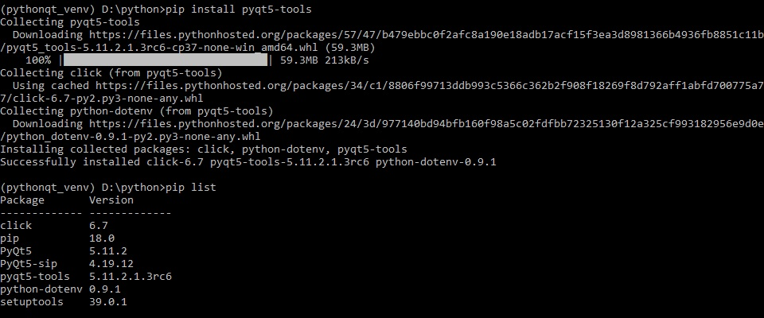
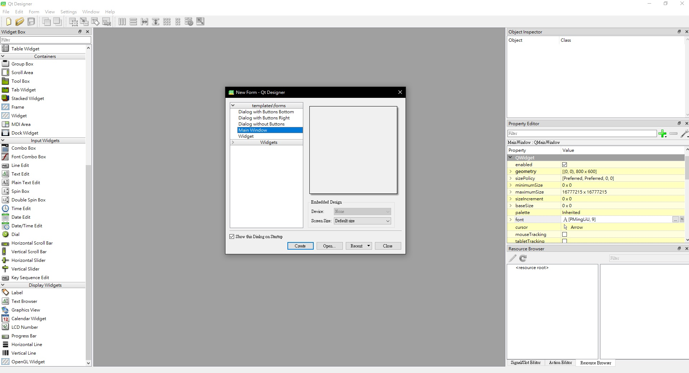
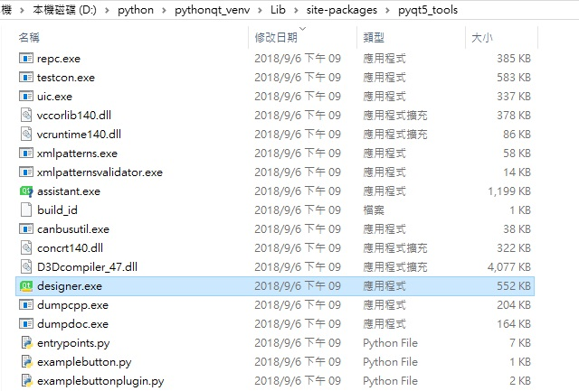
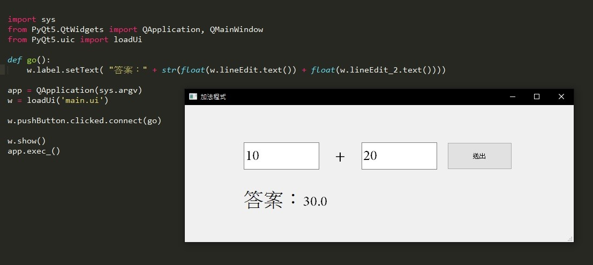

安裝 pyqt5 有很多種方法，本文為其中一種方式

自己筆記紀錄一下…

開發環境 Windows Python 3.7 64 位元

<br/>

# 一、使用 pip 安裝 Pyqt5

在 cmd 輸入：

```python{numberLines: true}
pip install pyqt5
```



備註：我是用 Python 內建的 venv 虛擬環境下開發

使用 pip list 查看安裝了哪些套件

發現多了 PyQt5 跟、PyQt5-sip



<br/>

# 二、安裝 pyqt5-tools

但我發現使用 pip 安裝 PyQt5 時，是沒有 Qt designer 開發環境

所以我們還必須安裝 pyqt5-tools

注意：這是一款非官方的套件

可參考：https://stackoverflow.com/questions/42090739/pyqt5-how-to-start-the-designer

在 cmd 輸入：

```python{numberLines: true}
pip install pyqt5-tools
```



安裝完之後進入到 pyqt5_tools 資料夾，看到有 designer.exe



qt designer 執行畫面



<br/>

# 三、範例程式

```python{numberLines: true}
import sys
from PyQt5.QtWidgets import QApplication, QMainWindow
from PyQt5.uic import loadUi
def go():
w.label.setText( "答案：" + str(float(w.lineEdit.text()) + float(w.lineEdit*2.text())))
app = QApplication(sys.argv)
w = loadUi('main.ui')
w.pushButton.clicked.connect(go)
w.show()
app.exec*()
```



使用 Qt Designer 設一個簡易的加法程式介面

我拉了幾個 textbox、button、label

最後儲存名為 main.ui

再跟上面程式碼做結合，用 loadUi(main.ui)方式
