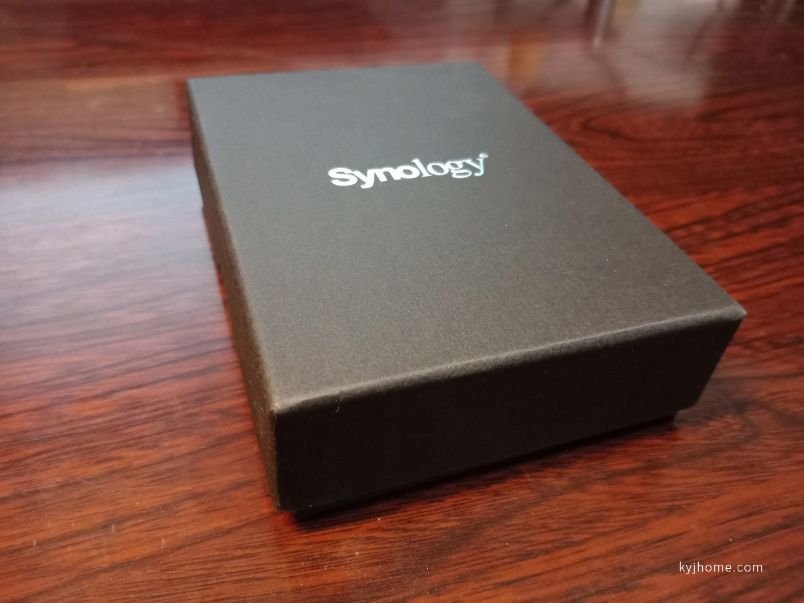
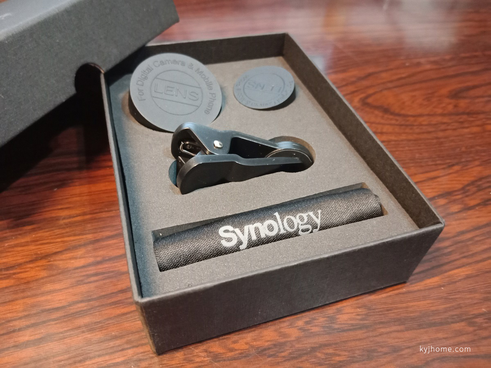
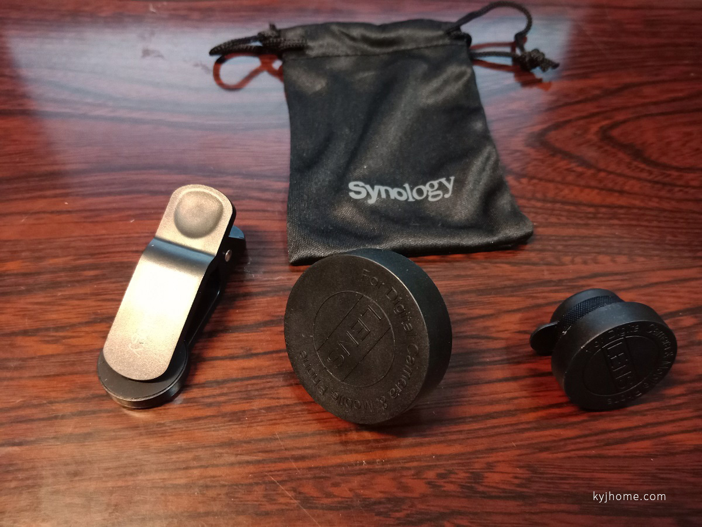
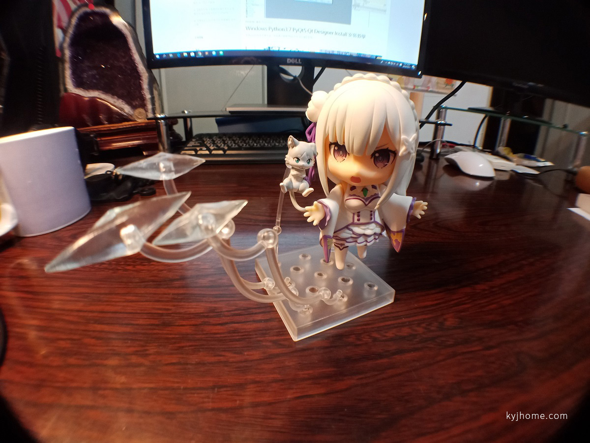
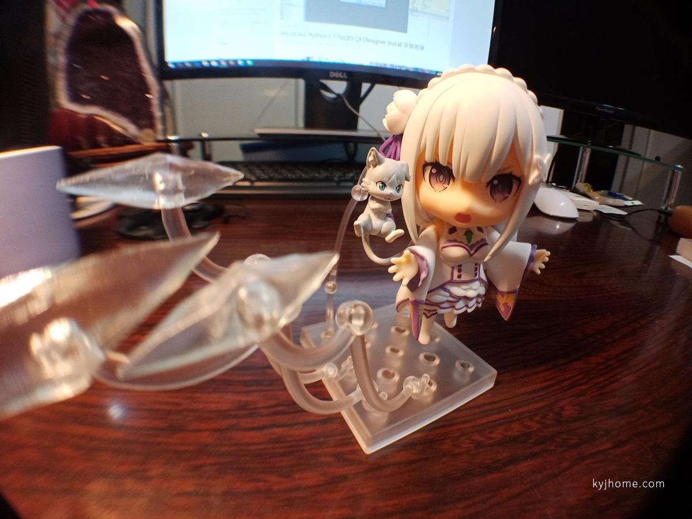
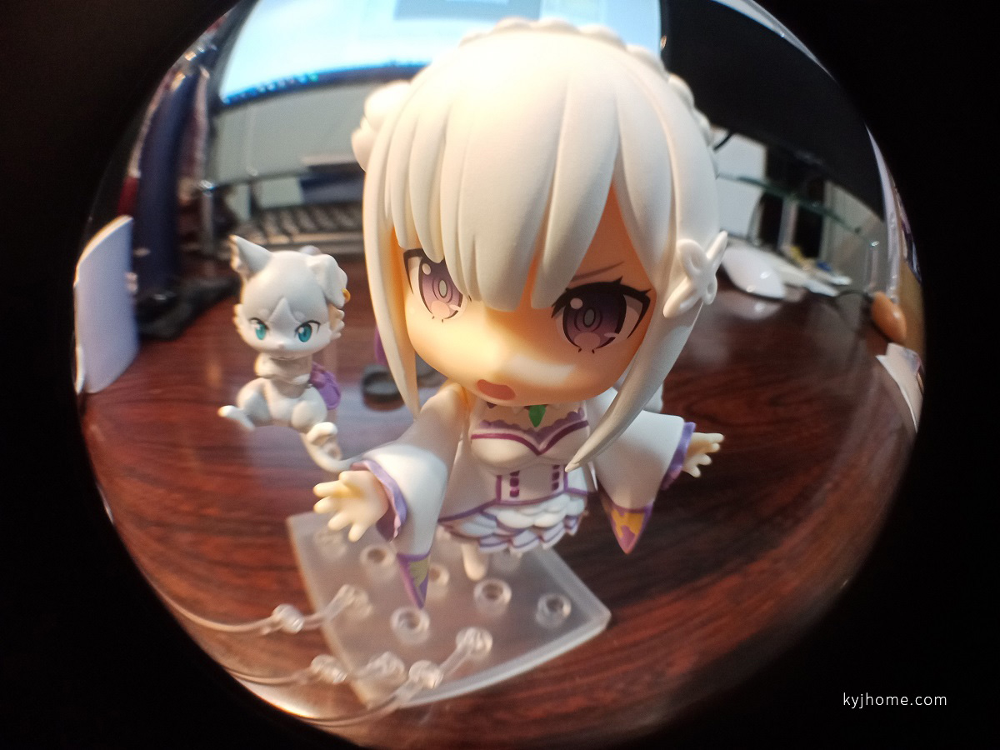
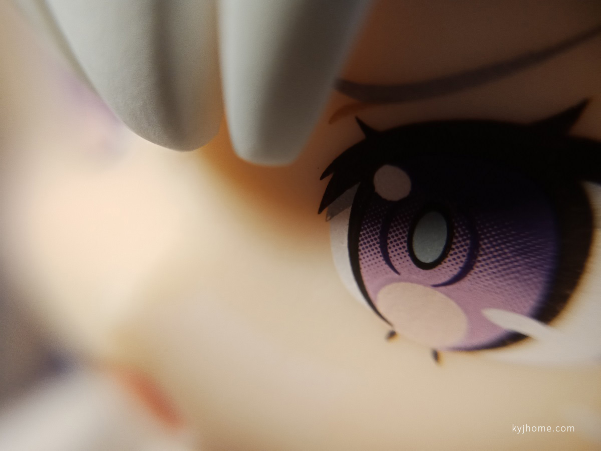

前幾個禮拜觀看一年一度產品發表的直播

很幸運地得到有獎徵答的精美好禮 ^\_^

 

拿到的當下，有點出乎意料之外！

看這精美包裝盒子，很有質感，真的非常用心~

 

內容物是 3 合 1 手機鏡頭

收納袋、鏡頭夾還印上 Synology 的 LOGO~~~

 

以下是隨便拍拍~~

0.4X 廣角鏡頭

 

180 度 魚眼鏡頭

 

微距鏡頭

以後可以用超近距離拍攝模型了 ლ(◉◞౪◟◉ )ლ

 

分享結束~~~~
